# Country Explorer 🌍

Country Explorer es una aplicación móvil construida con React Native que permite explorar países de todo el mundo, filtrarlos por diferentes criterios y ver detalles específicos de cada país. 
Este proyecto utiliza datos de la API GraphQL de `https://countries.trevorblades.com/` y la API de Unsplash para imágenes de países.
Ademas de poder renderizar videos con React native video y HLS.js.

## 📋 Requisitos

Para levantar este proyecto en tu máquina local, necesitas cumplir con los siguientes requisitos:

- **Node.js**: Versión 18 o superior. Puedes descargarlo desde [nodejs.org](https://nodejs.org).
- **npm** o **Yarn**: Gestor de paquetes para instalar dependencias (se recomienda Yarn para mejor rendimiento).
- **React Native CLI**: Para ejecutar la aplicación en un emulador o dispositivo físico.
- **Android Studio** o **Xcode**: Para emuladores de Android o iOS, respectivamente.
- **Emulador o dispositivo físico**: Un emulador configurado (como Android Emulator o iOS Simulator) o un dispositivo físico para probar la app.
- **Unsplash API Key**: (En el proyecto actual ya se tiene uno configurado con 45 cargas disponible ya que se encuentra en la capa free - Si en caso en la vista de detalle no carga una imagen en la parte superior es porque se agoto la cuota)

## 🛠️ Estructura del Proyecto

El proyecto está diseñado con una estructura modular y escalable, típica de aplicaciones frontend desarrolladas con **React** y **TypeScript**, e integrando **Apollo Client** para la gestión de datos a través de una API GraphQL. A continuación, se detalla la organización de los directorios y archivos clave dentro del directorio raíz `src/`:

- **`src/`**: Directorio raíz que contiene todo el código fuente de la aplicación.
  - **`assets/`**: Almacena recursos estáticos como imágenes, fuentes o cualquier otro archivo necesario para la interfaz de usuario.
  - **`config/`**: Contiene archivos de configuración global, como ajustes de entorno o parámetros para conectar con servicios externos.
  - **`declarations/`**: Incluye archivos de declaración de TypeScript (`.d.ts`), que definen tipos para bibliotecas externas o módulos personalizados, asegurando un tipado consistente.
  - **`modules/`**: Agrupa módulos reutilizables o funcionalidades específicas de la aplicación.
    - **`countries/`**: Módulo central dedicado a la gestión de datos y funcionalidades relacionadas con países.
      - **`components/`**: Contiene componentes React específicos para mostrar o interactuar con datos de países.
      - **`hooks/`**: Almacena hooks personalizados de React, probablemente para manejar lógica de estado o efectos relacionados con los países.
      - **`types/`**: Define tipos TypeScript específicos del módulo `countries`, garantizando un código fuertemente tipado.
      - **`services/`**: Contiene el archivo `apolloClient.ts`, que configura el cliente Apollo para realizar consultas y mutaciones a la API GraphQL.
      - **`shared/`**: Incluye utilidades o componentes compartidos que pueden ser reutilizados en otras partes del proyecto.
  - **`navigation/`**: Maneja la lógica de navegación, como la configuración de rutas o el flujo entre diferentes pantallas de la aplicación.
  - **`pages/`**: Agrupa las páginas principales de la aplicación.
    - **`countries/`**: Contiene el archivo `countries.page.tsx`, un componente de página escrito en TypeScript y React para mostrar una lista de países.
  - **`providers/`**: Almacena proveedores de contexto o estado global (por ejemplo, usando la API de contexto de React) para compartir datos o lógica entre componentes.
  - **`App.tsx`**: Archivo principal de la aplicación, escrito en TypeScript y React, que sirve como punto de entrada y coordina la renderización de los componentes principales.

Esta estructura refleja un enfoque modular y bien organizado, donde cada funcionalidad tiene su propio espacio definido. El uso de **TypeScript** asegura un código robusto y menos propenso a errores, mientras que **Apollo Client** facilita la interacción con una API GraphQL para la gestión eficiente de datos. La separación de preocupaciones entre componentes, hooks, tipos, servicios y páginas hace que el proyecto sea fácil de mantener y escalar.

## 🚀 Pasos para Levantar el Proyecto 

Sigue estos pasos para ejecutar el proyecto en tu máquina local:

1. **Clona el repositorio**:
   ```bash
   git clone https://github.com/JeanpierreSolis15/tech-interview.git
   cd tech-interview
2. **Instala las dependencias: Usando Yarn:**
    ```bash
    yarn install
    O usando npm:
    npm install
## Paso 2: Compila y ejecuta tu app

Con Metro ejecutándose, abre una nueva ventana/panel de terminal desde la raíz de tu proyecto React Native y usa uno de los siguientes comandos para compilar y ejecutar tu app de Android o iOS:

### Android

```sh
# Usando npm
npm run android

# O usando Yarn
yarn android
```

### iOS

Para iOS, recuerda instalar las dependencias de CocoaPods (esto solo debe ejecutarse en el primer clon o después de actualizar las dependencias nativas).

```sh
cd ios && pod install
```

```sh
# Usando npm
npm run ios

# O usando Yarn
yarn ios
```

## Configura el entorno de desarrollo:
Asegúrate de tener un emulador abierto o un dispositivo conectado.
Si usas Android, inicia el emulador desde Android Studio.
Si usas iOS, inicia el simulador desde Xcode.

## ✨ Características Principales 
Country Explorer incluye las siguientes características:

### Lista de Países: 
- Muestra una lista de países obtenidos de la API GraphQL de https://countries.trevorblades.com/.
- Cada país se presenta en un card con su bandera, nombre, código y continente.

### Filtrado Avanzado:
- Permite filtrar países por nombre (búsqueda), continente y moneda directamente desde el servidor GraphQL.
- Los filtros se aplican al presionar "Aplicar Filtros" en el drawer, optimizando las solicitudes al servidor.
** Drawer de Filtros: **
- Un drawer lateral que permite seleccionar continentes y monedas para filtrar los países.
- Los filtros se aplican de forma controlada, solo cuando el usuario confirma.
### Página de Detalle del País: 
- Al tocar un país, navegas a una página de detalle que muestra:
- Una imagen del país obtenida de Unsplash.
** Información básica (código, continente, capital, moneda). ** 
- Lista de idiomas oficiales.
- Código telefónico.
** Carga Optimizada de Imágenes: ** 
- Uso de FastImage para cargar imágenes de banderas y fotos de países de manera eficiente.
- Lazy loading integrado para mejorar el rendimiento.
- Integración con HLS.js donde renderizamos contenido de tipo HLS, incluye opciones como (play/pause, progreso).
- Integración con react native video donde renderizamos contenido de tipo HLS,  incluye opciones como (play/pause, progreso).

### Diseño Responsivo y Moderno: 
Uso de Tailwind CSS para estilos consistentes y responsivos.

## 📚 Librerías Utilizadas ## 
React Native: Framework principal para construir la aplicación móvil.

React Navigation: Para la navegación entre pantallas (lista de países y página de detalle).

Apollo Client: Para realizar consultas GraphQL a la API de países.

Zustand: Gestión de estado global (filtros, búsqueda, datos de países).

Axios: Para realizar solicitudes HTTP a la API de Unsplash.
FastImage: Para la carga optimizada de imágenes (banderas y fotos de países).

React Native Vector Icons: Para íconos en la interfaz (como el ícono de filtro).

React Native Video : Biblioteca React Native que proporciona un componente de video para renderizar contenido multimedia como videos y transmisiones.

HLS.JS : HLS.js es una biblioteca de JavaScript que implementa un cliente de transmisión en vivo HTTP. Utiliza vídeo HTML5 y extensiones MediaSource para la reproducción.

## Librerías de Diseño ## 
React Native Paper: Proporciona componentes de UI como Button, Card, IconButton, y otros elementos estilizados.

NativeWind (Tailwind CSS para React Native): Para aplicar estilos modernos y responsivos con clases de Tailwind (ej. bg-white, rounded-lg, shadow-md).

React Native Picker: Para los selectores de continente y moneda en el drawer de filtros.

## Preview Android ## 
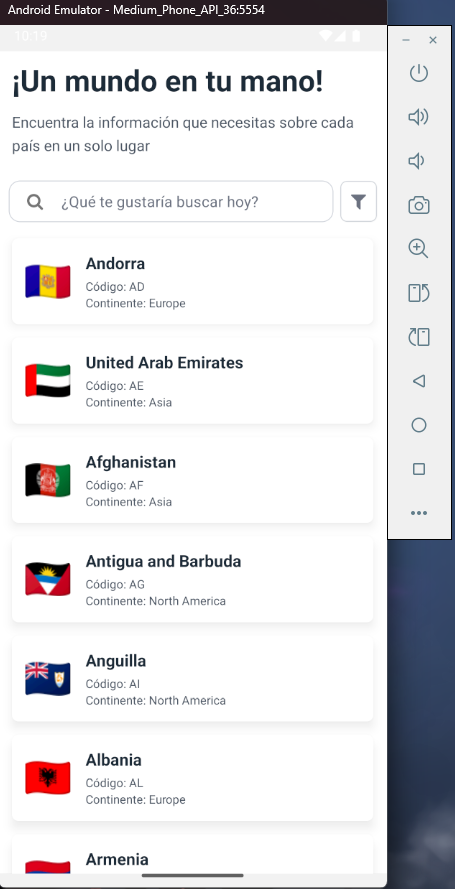
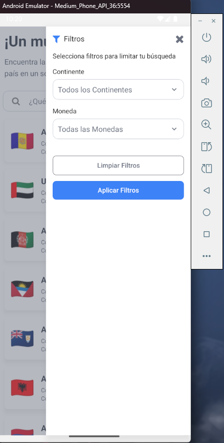
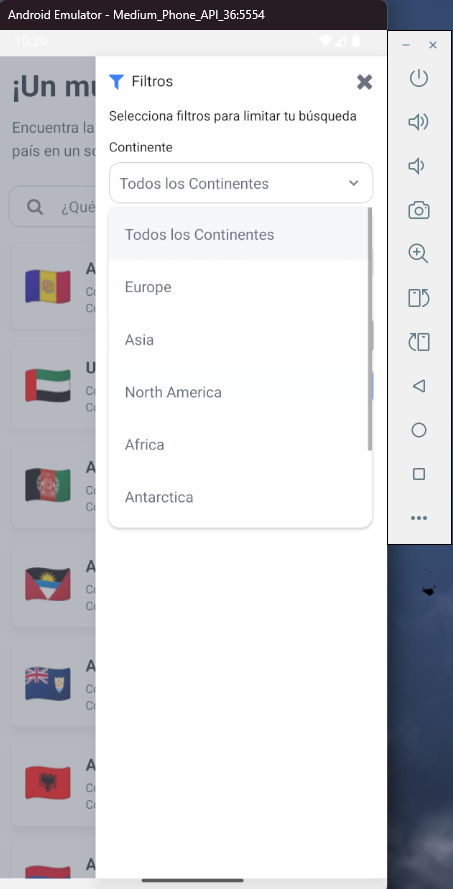
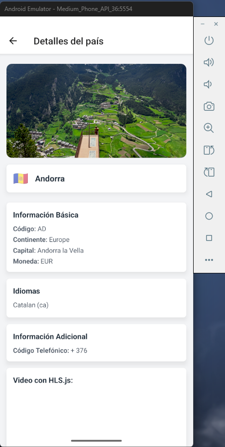
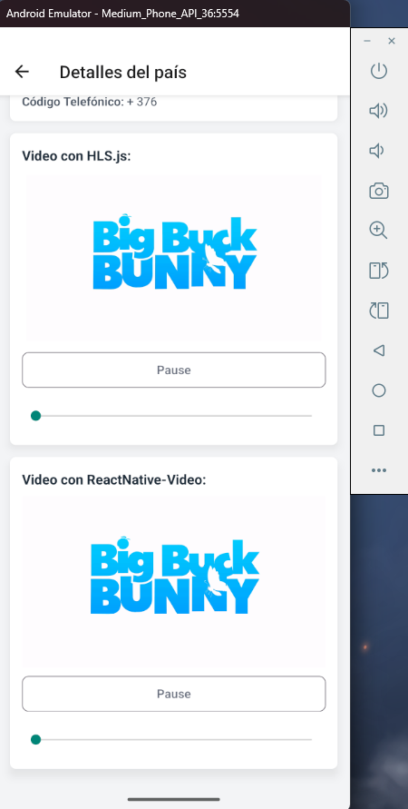
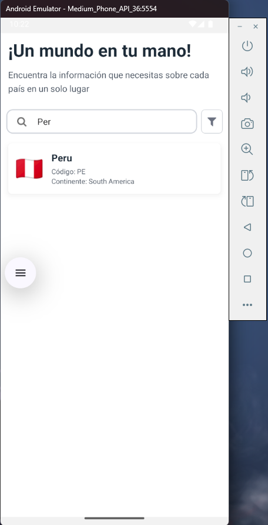

## Preview iOS ## 
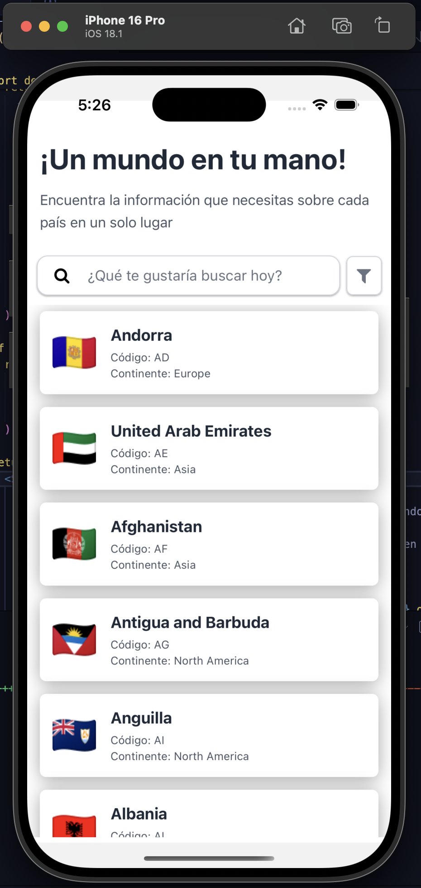
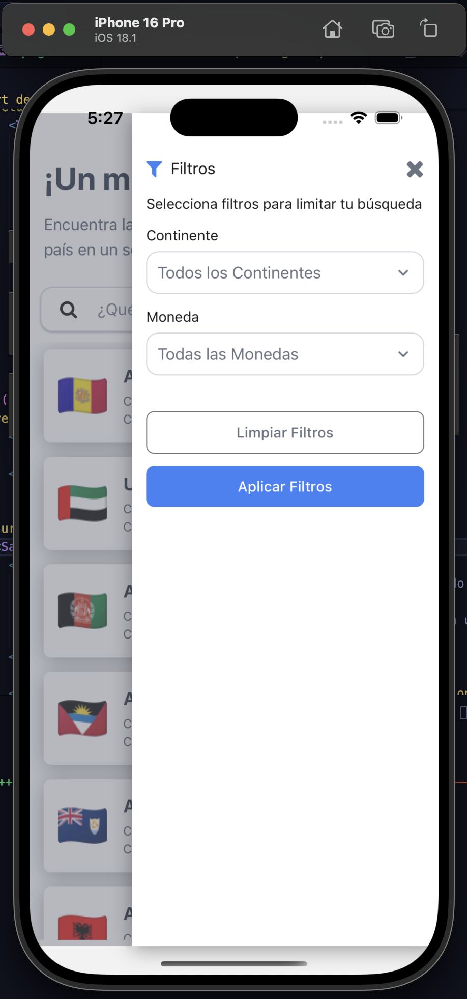
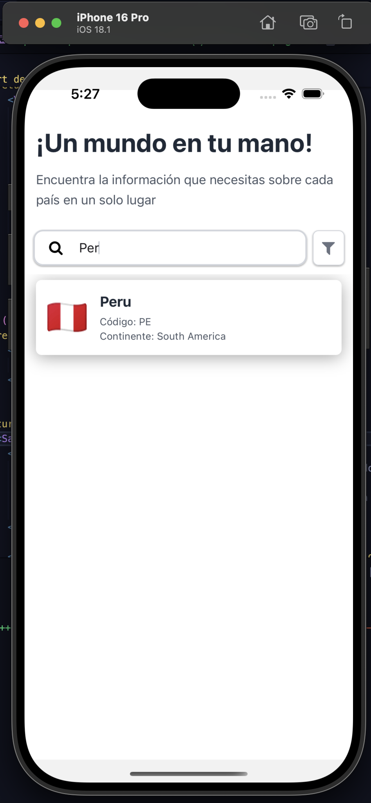
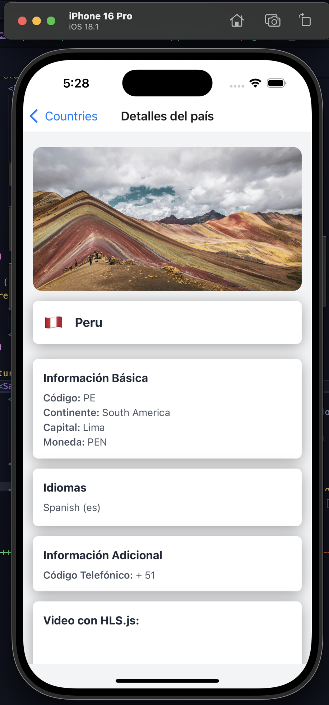
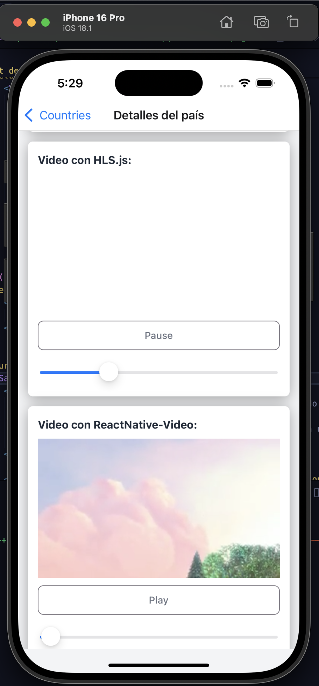
